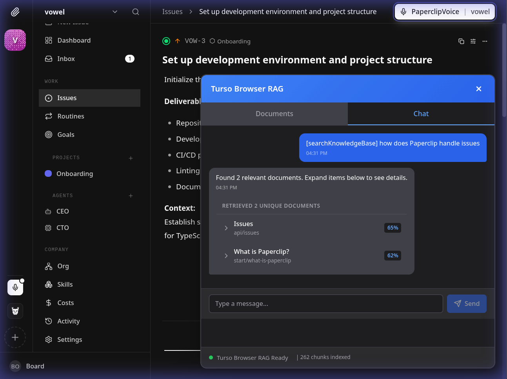
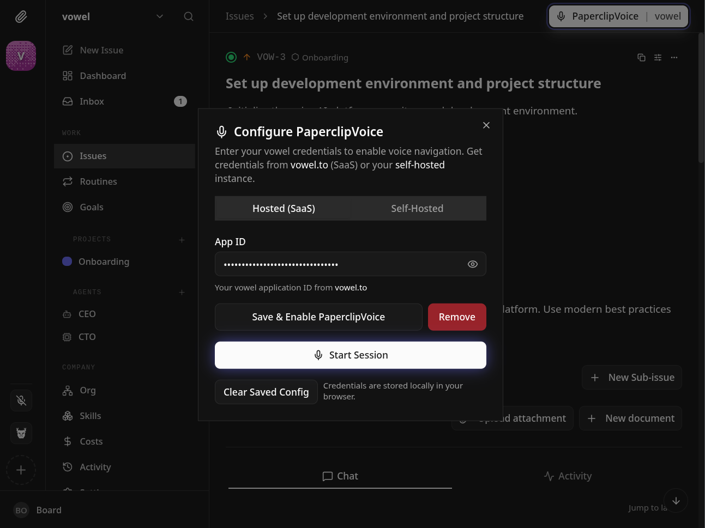

# @paperclipai/ui | vowel

Published static assets for the Paperclip board UI.

## Voice and local docs (Vowel + Turso browser RAG)

This app integrates **[vowel.to](https://vowel.to)** voice (`@vowel.to/client`) with a **browser-local** retrieval layer: precomputed Paperclip documentation RAG chunks and embeddings are loaded into **[Turso](https://docs.turso.tech)** via `@tursodatabase/database-wasm` (WASM + OPFS), so semantic search stays on the device. The assistant can answer questions grounded in the same material as the public docs, including [What is Paperclip?](https://docs.paperclip.ing/start/what-is-paperclip) and the rest of [docs.paperclip.ing](https://docs.paperclip.ing/).

### Vowel (voice agent)

Vowel adds a real-time voice agent to the UI: **navigation** through router adapters, **custom actions** registered on the client (prefer updating app state over DOM automation), and **context sync** so the model sees route and app state. Initialization uses a hosted **`appId`** flow (`VITE_VOWEL_APP_ID`); initialize only after mounts/stores are ready, keep `VowelProvider` on a React state–held client, and register actions before starting a session. See the **vowel-react** skill in `.agents/skills/vowel-react/SKILL.md` for full patterns (TanStack adapters, `buildVowelContext`, captions, `getGameState` for the first greeting).

### Turso browser RAG

Runtime behavior matches the **vowel-turso-rag** skill (`.agents/skills/vowel-turso-rag/SKILL.md`): Turso WASM holds vectors, the browser generates **query embeddings** (e.g. `all-MiniLM-L6-v2` via `@huggingface/transformers` in `public/vowel-rag/query-embeddings.ts`), and search uses vector-distance SQL. The dev server enables **cross-origin isolation** (COOP/COEP) so `SharedArrayBuffer` works. Voice actions in `src/vowel.rag-actions.ts` call the same Turso layer as the optional RAG debug UI; voice startup waits on `turso-rag-voice-gate` until the index and embeddings are ready.

### Prebuilt index (Paperclip docs)

The shipped **prebuilt** artifact is served at **`/vowel-rag/rag-index.yml`** (source tree: `public/vowel-rag/rag-index.yml`, plus `rag-documents.yml`). It is produced offline by chunking and embedding docs so the client does not embed documents at first load beyond loading YAML and hydrating the DB—see **rag-prebuild** (`.agents/skills/rag-prebuild/SKILL.md`) for the general pattern and `public/vowel-rag/README_VOWEL_RAG_EMBEDDINGS.md` for this app’s embedding pipeline and file layout.

### Environment (common)

| Variable | Purpose |
| -------- | ------- |
| `VITE_VOWEL_APP_ID` | vowel.to app id for the voice client -or- leave empty to allow users to individually enter there own vowel creds |
| `VITE_TURSO_RAG_DEBUG` | Set `true` in dev to surface the Turso RAG debug UI (transcripts + retrieval) |

## Vowel configuration (realtime voice)

Paperclip uses Vowel for **realtime, conversational voice**: speech capture, streaming responses, navigation, and custom **RAG-backed** actions (`src/vowel.rag-actions.ts`) so answers can use local doc retrieval. You can supply credentials in two complementary ways: **environment variables** at build time (good for defaults or CI images) or the **in-app voice settings** shown below (stored in `localStorage` as `paperclip-voice-config` via `PaperclipVoiceConfigModal`).

### Hosted (SaaS)

With a **[vowel.to subscription](https://vowel.to)**, create an app in the platform and use its **App ID**. The client connects to the hosted realtime endpoint (`wss://realtime.vowel.to/v1` by default, overridable with `VITE_VOWEL_URL`). This is the fastest path: managed apps, tokens, and routing without running Vowel infrastructure yourself.

### Self-hosted

For infrastructure and token boundaries you control, run the **self-hosted Vowel stack** ([Self-Hosted | vowel Docs](https://docs.vowel.to/self-hosted/)): typically **Core** (app management and token issuance), the **Realtime Engine** (OpenAI-compatible voice WebSocket), and optionally **Echoline** for fully local STT/TTS. Issue credentials from your Core/backend, then in Paperclip either paste a **JWT** (realtime URL can be carried in the token payload) or set **App ID + realtime WebSocket URL** in the UI. For URL without a JWT payload, set **`VITE_VOWEL_URL`** to your engine’s WebSocket base; use **`VITE_VOWEL_USE_JWT=true`** when the modal should run in JWT mode.

| Variable | When to use |
| -------- | ----------- |
| `VITE_VOWEL_APP_ID` | Hosted SaaS App ID (or self-hosted app id with URL/JWT as below) |
| `VITE_VOWEL_URL` | Override realtime WebSocket URL (hosted default or self-hosted engine) |
| `VITE_VOWEL_USE_JWT` | Set `true` to enable JWT-oriented flows in the configuration UI |

Logic lives in `src/vowel.client.ts` (hosted vs self-hosted, JWT URL extraction, `subscribeToVowelChanges` / `setAppId`). See `.agents/skills/vowel-react/SKILL.md` for React integration patterns.

## What gets published

The npm package contains the production build under `dist/`. It does not ship the UI source tree or workspace-only dependencies.

## Typical use

Install the package, then serve or copy the built files from `node_modules/@paperclipai/ui/dist`.

## Local development

This package lives in the Paperclip **pnpm workspace**. From the repository root (Node 20+, pnpm 9.15+ per the [repo README](../README.md#quickstart)):

| Goal | Command |
| ---- | ------- |
| Vite dev server only (UI at [http://localhost:5173](http://localhost:5173)) | `pnpm dev:ui` |
| Same from this directory | `pnpm dev` |
| Typecheck | `pnpm typecheck` |
| Production build | `pnpm build` |
| Preview the build | `pnpm preview` |

The Vite dev server **proxies `/api`** to `http://localhost:3100` (see `vite.config.ts`). For a working app against the real API, run the Paperclip server as well—for example `pnpm dev:server` from the repo root, or `pnpm dev` for the full watched stack (API + UI) as described in [**doc/DEVELOPING.md**](../doc/DEVELOPING.md).

Copy or create `ui/.env` for local-only flags (for example `VITE_VOWEL_APP_ID`, `VITE_TURSO_RAG_DEBUG=true` to show the Turso RAG debug panel). Vite requires the `VITE_` prefix for variables exposed to the client.
